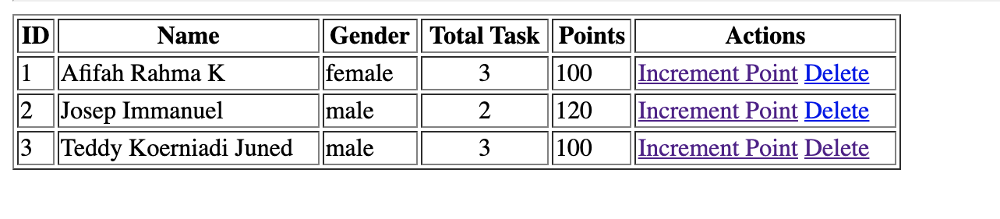
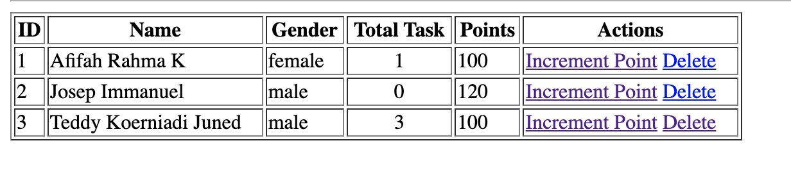
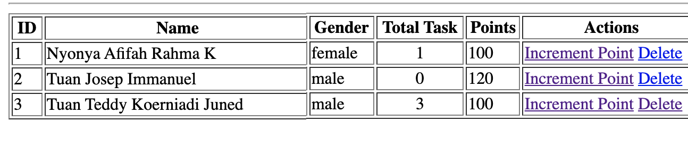
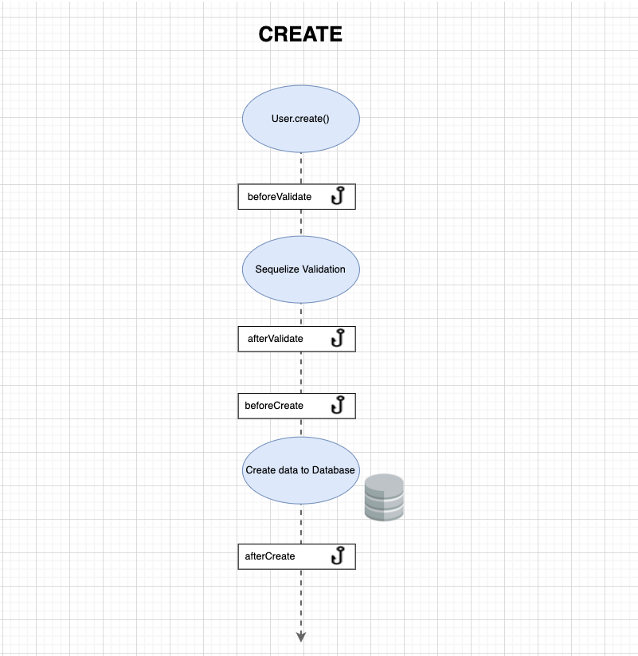

# Materi  
- Eager Loading
- [Instance Method](#instance-method)
- [Static Method](#static-method)
- [Seqeulize Hooks](#hooks)

Telah tersedia aplikasi dengan fitur Create, Read, Delete & <a href="https://sequelize.org/master/class/lib/model.js~Model.html#static-method-increment"> Increment </a> Point terhadap User

Lecture kita kali ini ada 4 materi dengan 3 diantara sudah kalian kenal pada lecture pagi dan pada week 1.

<br>

## Eager Loading

Dibawah ini total task di dapat dari Eager Loading 

namun tahu kah kamu bahwa dalam properti include dan di kondisikan? 
Sehingga kita dapat menampilkan total task yang berstatus `false`



## Instance Method

Instance method, method dijalankan oleh instance dan method ini dapat mengakses this, seperti pada umumnya kita buat pada class di model. 

Kita ingin user memiliki nama dengan panggilan Tuan / Nyonya tanpa mengubah data dalam table.




## Static Method 

Tahukah kalian bahwa selama ini kalian menggunakan static method di sequelize?  
tapi semua itu adalah static method yang telah sediakan sequelize seperti built-in function.  

```txt
Model.namaMethod()

ex : 
User.create()
```

Pada **case** kali ini kita akan buat versi kita sendiri, misalnya kita ingin membuat feature yang bernama `Increment Random 0 - 9`.  
Feature ini akan menggantikan feature increment yang telah ada.


## Hooks 

Hooks, hooks adalah sebuah proses yang **terkait** pada eksekusi event(dapat sebelum atau setelah) disebut juga sebagai lifecyle.  
Hooks bisa saja terdapat di framework lain dengan cara yang berbeda.

Mungkin saat ini urutan fitur create yang telah kalian kenal adalah 

> Input data -> Validasi -> Data ditambahkan ke database -> Kembali ke halaman utama

Tapi itu bukan hooks, itu merupakan flow atau algorithma dari fitur create.

---


### [Sequelize Hooks (click here)](http://sequelize.org/master/manual/hooks.html)  
sebuah proses yang terjadi sebelum dan setalah eksekusi method sequlize (create, update, destroy, etc). 

buka slide H8 untuk menjelaskan sedikit keamanan data password



Apabila hooks tidak di declare maka dia tidak ada

#### CASE
Jalankan nodemon ke aplikasi  

User dengan bebas membuat nama mereka dengan bebagai format namun pada database kita harus terformat dengan proper
```txt
Example : 
Input dari user  
name : ayu SUDI dwijayanti
gender : female

Data yang tersimpan pada database 
name : Ayu Sudi Dwijayanti
gender : female 
points : 0
```

Untuk hooks method Delete (destroy) dan Update menggunakan <a href="https://sequelize.org/master/manual/hooks.html#:~:text=can%20pass%20the%20%7B-,individualHooks,-%3A%20true%20%7D%20option%20to">individualHooks</a> pada options
```txt
User.update(value, options)
User.destroy(options)
```